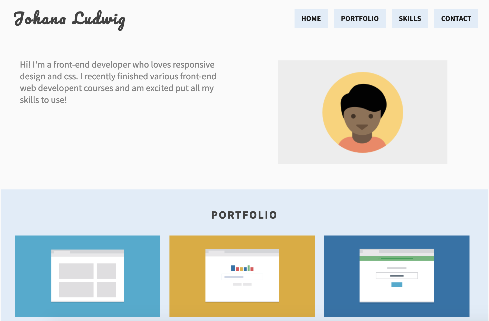

Project 2 - Mobile-first Responsive Layout
=========

# Introducction
Using HTML, CSS, and responsive design, I created a mobile-first web page with a layout that adjusts to fit mobile phones, tablets, and desktop displays.

